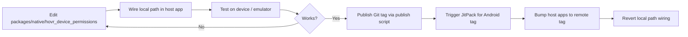

# Local development workflow

**Default for rider and driver apps: remote GitHub dependencies only.**  
Use the local path below **only while testing changes** to this module. Revert to remote before merging app PRs.

## Workflow



### 1. Edit source

Rider working copy:

```text
packages/native/hovr_device_permissions/
```

Driver working copy (optional, for cross-app checks):

```text
native/hovr_device_permissions/   # in hovr_driver repo
```

Keep rider and driver copies in sync, or develop in rider and publish once.

### 2. Wire local path (testing only)

**Rider — Android**

`android/settings.gradle` — add temporarily:

```gradle
include ':hovr_device_permissions'
project(':hovr_device_permissions').projectDir =
    new File(settingsDir, '../packages/native/hovr_device_permissions/android/hovr_device_permissions')
```

`android/app/build.gradle`:

```gradle
implementation project(':hovr_device_permissions')
```

Remove `implementation 'com.github.vishalsharma-hovr:hovr_device_permissions:…'` while testing locally.

**Rider — iOS**

`ios/Podfile` — replace the Git line temporarily:

```ruby
pod 'HovrDevicePermissions', :path => '../packages/native/hovr_device_permissions'
```

Then:

```bash
cd ios && pod install
```

**Driver — Android**

Same Gradle pattern; module path:

```gradle
project(':hovr_device_permissions').projectDir =
    new File(settingsDir, '../native/hovr_device_permissions/android/hovr_device_permissions')
```

**Driver — iOS**

```ruby
pod 'HovrDevicePermissions', :path => '../native/hovr_device_permissions'
```

### 3. Test

```bash
# Library unit tests
cd packages/native/hovr_device_permissions
./gradlew :hovr_device_permissions:testDebugUnitTest

# Rider app
cd android && ./gradlew :app:assembleDebug
```

Manual QA: cold start, deny/grant location and notifications, confirm dialogs and system sheets order.

### 4. Publish (after tests pass)

```bash
cd packages/native/hovr_device_permissions
./tool/publish_to_github.sh v1.2.9   # next semver tag
```

Requires `gh auth login` as `vishalsharma-hovr`.

### 5. Android — trigger JitPack

JitPack builds on first request. Open:

```text
https://jitpack.io/#vishalsharma-hovr/hovr_device_permissions/v1.2.9
```

Wait for **Get it** / green build before updating host apps.

### 6. Restore remote wiring in host apps

**Rider / driver — Android**

Remove local `include` from `settings.gradle`. In `app/build.gradle`:

```gradle
implementation 'com.github.vishalsharma-hovr:hovr_device_permissions:v1.2.9'
```

Ensure `android/build.gradle` has:

```gradle
maven { url 'https://jitpack.io' }
```

**Rider / driver — iOS**

```ruby
pod 'HovrDevicePermissions', :git => 'https://github.com/vishalsharma-hovr/hovr_device_permissions.git', :tag => 'v1.2.9'
```

```bash
cd ios && pod update HovrDevicePermissions
```

**Native Xcode (SPM)** — optional; tag `1.2.9` resolves from Git after publish.

### 7. Do not merge local path into main

Committed host app config must always use remote tags / JitPack — never `project(':hovr_device_permissions')` or `:path` pods on `main`.

## Current published release

| Platform | Remote coordinate | Notes |
|----------|-------------------|--------|
| Android | `com.github.vishalsharma-hovr:hovr_device_permissions:v1.2.4` | Last JitPack build confirmed |
| iOS CocoaPods | tag `v1.2.6` | GitHub |
| iOS SPM | exact `1.2.6` | `Package.swift` at repo root |

Bump this table after each publish.
